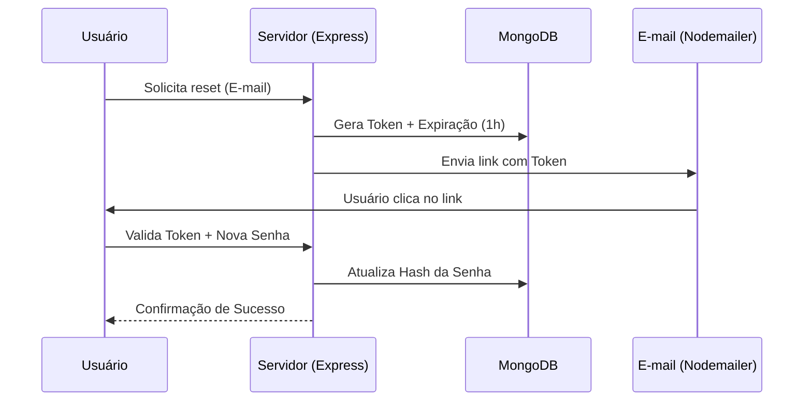

# DOCUMENTAÇÃO TÉCNICA E FUNCIONAL - IMPACTA MAIS

> "Impacta Mais: Uma plataforma de conexão social para projetos e eventos de impacto positivo, focada em acessibilidade (WCAG 2.1 AA) e performance (Node.js + MongoDB Nativo)."

---

## 1. ARQUITETURA DO SISTEMA

### Front-end (EJS + CSS Vanilla)
- **Engine**: EJS para renderização server-side dinâmica.
- **Estilização**: CSS Vanilla com Design System baseado em variáveis (Cores: Navy #0f172a, Brand Blue #12678D, Emerald #10b981).
- **Responsividade**: Layout fluído de **320px a 1920px** com componentes adaptativos (ex: Navbar com Menu Hambúrguer).
- **UX Especial**: 
    - Splash Screen animado (Handshake SVG) exibido apenas no primeiro acesso da sessão.
    - Scrollbars customizados em áreas de alta densidade de informação (ex: Lista de Amigos no compartilhamento).

### Back-end (Node.js + Express 5)
- **Sessões**: `express-session` com persistência em MongoDB via `connect-mongo`.
- **Segurança**: 
    - `bcryptjs` para hashing de senhas.
    - `helmet` para proteção de cabeçalhos.
    - Escapamento de Regex para evitar NoSQL Injection na busca.
    - Validação de tokens para recuperação de senha.

### Banco de Dados (MongoDB Nativo)
- **Coleções**:
    - `users`: Perfis, amizades, notificações, histórico de eventos.
    - `posts`: Projetos sociais, slugs únicos, curtidas, comentários e descrições detalhadas.
    - `events`: Agenda de ações sociais e lista de participantes.
    - `messages`: Histórico de mensagens privadas entre amigos.
    - `sessions`: Persistência de estado do usuário.

---

## 2. FUNCIONALIDADES IMPLEMENTADAS

### 🔐 Autenticação e Perfil
- **Fluxo de Cadastro**: Validação de e-mail único e confirmação de senha.
- **Login Seguro**: Gestão de sessão persistente.
- **Recuperação de Senha**: Sistema de "Esqueci minha senha" com envio de e-mail (Nodemailer) e tokens de expiração (1h).
- **Edição de Perfil**: Alteração de Biografia e Foto de Perfil (Suporte a Base64).

### 🤝 Ecossistema Social e Compartilhamento
- **Sistema de Amizade**: Envio, aceitação e recusa de solicitações entre usuários.
- **Notificações em Tempo Real**: Alertas visuais para novas solicitações, aceites de amizade, novas mensagens e interações em projetos.
- **Mensagens Privadas**: Chat direto entre amigos com persistência de histórico e sincronização dinâmica.
- **Busca Global**: Barra de pesquisa inteligente que localiza **Projetos** e **Pessoas** simultaneamente.
- **Compartilhamento Integrado**: 
    - Modal de compartilhamento com cópia rápida de URL do projeto.
    - **Encaminhamento Direto**: Envio de links de projetos para amigos via sistema de mensagens interno com um clique.

### 🚀 Gestão de Conteúdo
- **Projetos (Posts)**:
    - Criação com upload de imagem, descrição curta e **descrição detalhada (Rich Text/Long Description)**.
    - Geração automática de Slugs amigáveis para URLs limpas.
    - Sistema de **Likes** (curtir/descurtir) e **Comentários**.
    - Filtros por categoria e ordenação por popularidade ou data.
- **Eventos**:
    - Agendamento com data, hora, local e descrição detalhada.
    - Inscrição e cancelamento de participação.
    - Lista de participantes integrada ao perfil do usuário.

---

## 3. DIRETRIZES DE ACESSIBILIDADE (WCAG 2.1 AA)

1.  **Navegação por Teclado**: 
    - *Skip Link* no topo para pular direto para o conteúdo.
    - Estados de `:focus-visible` claramente definidos com contornos de alto contraste.
    - Modais acessíveis com trava de scroll e fechamento via teclado/fundo.
2.  **Semântica HTML5**: Uso rigoroso de `<main>`, `<nav>`, `<article>`, `<section>` e hierarquia correta de `<h1>-<h6>`.
3.  **Contraste e Cores**: Paleta de cores validada para garantir legibilidade (Relação > 4.5:1).
4.  **Formulários**: Todos os campos possuem `<label>` associado e atributos `aria-required` onde necessário.
5.  **Imagens**: Atributos `alt` descritivos em todos os componentes de mídia.

---

## 4. ESPECIFICAÇÕES TÉCNICAS (EXEMPLOS)

### Fluxo de Recuperação de Senha (Seguro)


### Modelo de Dados: Projeto (Post)
```javascript
{
  title: String,
  slug: String, // Único
  category: String,
  description: String, // Resumo
  longDescription: String, // Detalhes completos
  image: String, // Base64 otimizado
  authorId: ObjectId,
  likes: [ObjectId], // Array de IDs de usuários
  comments: [{
    userId: ObjectId,
    userName: String,
    content: String,
    createdAt: Date
  }],
  status: String, // "Ativo", "Concluído", etc.
  createdAt: Date
}
```

---

## 5. STATUS DE VALIDAÇÃO (CHECKLIST)

- [x] **Responsividade**: Testado em Mobile (320px), Tablet (768px) e Desktop (1920px).
- [x] **Segurança**: Senhas criptografadas e rotas protegidas por middleware de sessão.
- [x] **Acessibilidade**: Sem erros críticos no Lighthouse A11y; foco visível em todos os elementos.
- [x] **Performance**: Imagens otimizadas no lado do cliente antes do upload (limitadas a 2MB).
- [x] **SEO**: Títulos dinâmicos e metadados básicos implementados.

---

## 6. MANUTENÇÃO E EXPANSÃO
- **Logs**: Monitoramento básico via console em rotas críticas e autenticação.
- **Escalabilidade**: Estrutura preparada para adição de WebSockets para Chat em Tempo Real (atualmente via pooling/sync).
- **Deploy**: Configurado para Render com suporte a proxies e cookies seguros.
