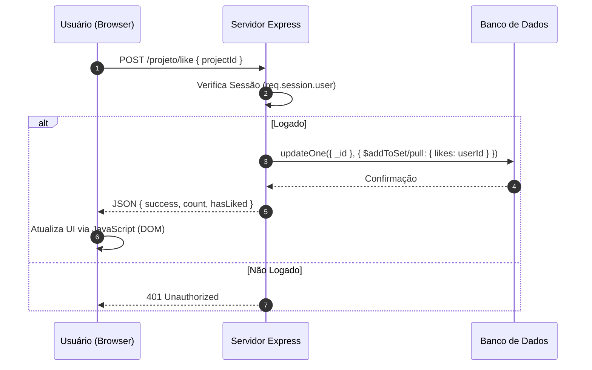

# ARQUITETURA E ACESSIBILIDADE - IMPACTA MAIS

> "Objetivo: conteúdo utilizável de **320px a 1920px**, com foco em acessibilidade (WCAG 2.1 AA) e arquitetura robusta usando Node.js e MongoDB Nativo."

---

## 1. ARQUITETURA DO SISTEMA

### Front-end (EJS + CSS Responsivo)
- **Responsabilidade**: Renderizar a UI dinamicamente, coletar entradas e garantir uma experiência acessível.
- **Diferencial**: Uso de CSS Vanilla com variáveis para design system e media queries fluidas.
- **Acessibilidade**: Implementação de *Skip Link*, estados de foco visíveis e estrutura semântica rigorosa.

### Back-end (Node.js + Express 5)
- **Responsabilidade**: Gestão de rotas, autenticação via `express-session` + `bcrypt`, e orquestração de dados.
- **Persistência**: Uso do **Driver Nativo do MongoDB** para máxima performance e controle, evitando abstrações desnecessárias (como ORMs).

### Banco de Dados (MongoDB)
- **Coleções Principais**:
  - `users`: Dados de perfil, credenciais (hash) e eventos inscritos.
  - `posts`: Projetos sociais, incluindo metadados, likes e comentários.
  - `events`: Cronograma de atividades e ações sociais.
- **Segurança**: Índices únicos em `email` e validação via lógica de negócio no back-end.

---

## 2. DIAGRAMA DE FLUXO (Exemplo: Like em Projeto)



---

## 3. DIRETRIZES DE ACESSIBILIDADE (IMPLEMENTADAS)

1.  **Skip Link**: Link invisível no topo da página que se torna visível ao focar, permitindo pular a navegação diretamente para o `#main-content`.
2.  **Focus Visible**: Regra global para garantir que todos os elementos interativos tenham um contorno claro (`outline`) ao serem acessados via teclado.
3.  **Contraste WCAG**: Uso da paleta Emerald e Navy garantindo contraste superior a 4.5:1 em textos informativos.
4.  **Semântica**: Uso correto de `<main>`, `<nav>`, `<footer>` e apenas um `<h1>` por página.

---

## 4. EXEMPLOS PRÁTICOS (STACK REAL)

### Modelo de Dados (Driver Nativo)
```javascript
// Exemplo de inserção de comentário (index.js)
const comment = {
    userId: new ObjectId(req.session.user.id),
    userName: req.session.user.name,
    content: content,
    createdAt: new Date()
};

await db.collection('posts').updateOne(
    { _id: new ObjectId(projectId) },
    { $push: { comments: comment } }
);
```

### Formulário Acessível (EJS)
```html
<div class="form-group">
    <label for="email">Endereço de E-mail</label>
    <input type="email" id="email" name="email" required 
           aria-required="true" placeholder="exemplo@email.com">
</div>
```

---

## 5. CHECKLIST DE VALIDAÇÃO

- [x] Responsividade testada de 320px a 1920px.
- [x] Navegação por teclado funcional (Skip Link ativo).
- [x] Ausência de scroll horizontal em dispositivos móveis.
- [x] Labels presentes em todos os campos de formulário.
- [x] Erros de autenticação amigáveis e visíveis.

---

## 6. PRÓXIMOS PASSOS

- Implementar `prefers-reduced-motion` para animações críticas.
- Adicionar auditoria automática de acessibilidade no pipeline de CI/CD.
- Refinar metadados de SEO para compartilhamento em redes sociais.
endas e transcrições para mídia.  
- Estratégia de backup/restore para MongoDB; TLS e roles/privileges.
